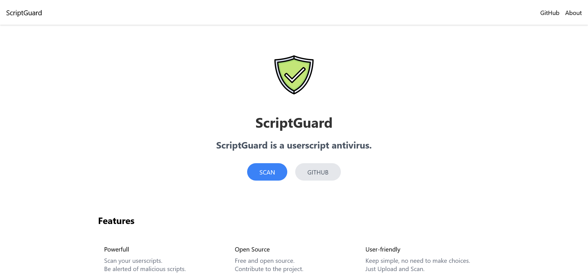

<h1 align="center">
 
     
    ScriptGuard
</h1>
<h4 align="center">
    <strong>a userscript antivirus</strong>
</h4>

    <strong>
        <a href="https://scriptguard.lima.zone/" target="_blank">Website (Proof of Concept)</a>
        •
        <a href="https://github.com/black-backdoor/ScriptGuard">GitHub</a>
    </strong>

&nbsp;

  

## Future
The goal of this project is to create a website where users can upload their userscripts and have them scanned for malicious code.

The current [Website](https://scriptguard.lima.zone/) is a proof of concept and only scans for a few basic patterns. 

