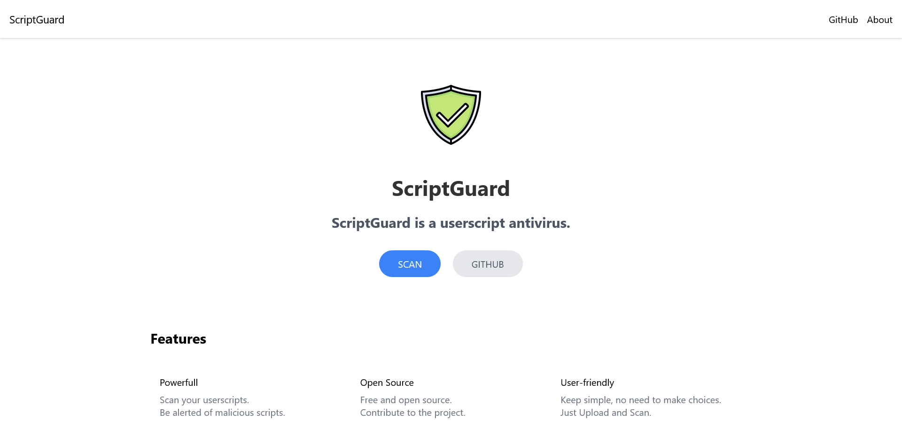

  

 <strong>
   <a href="https://scriptguard.lima.zone/" target="_blank">Website</a>
  •
  <a href="https://github.com/black-backdoor/ScriptGuard">GitHub</a>
 </strong>

# ScriptGuard
 a userscript antivirus

## ToDo
- [ ] Match
- [ ] Antifeatures
- [ ] Grant
- [ ] Display Warings / Results in the UI